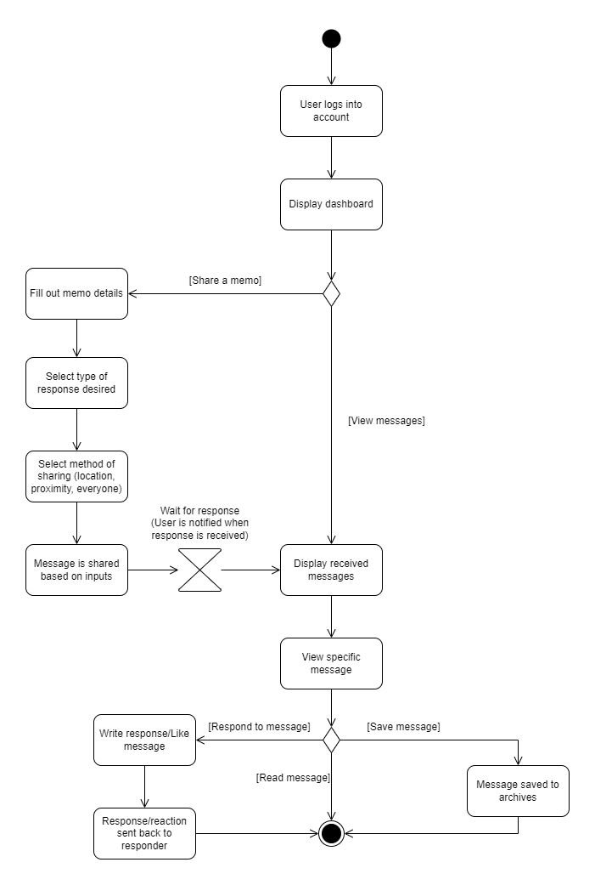
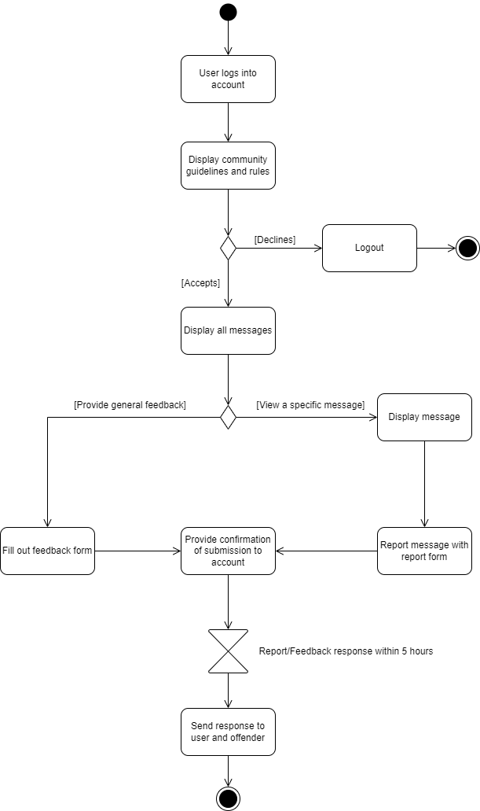

# Specification Phase Exercise

A little exercise to get started with the specification phase of the software development lifecycle. See the [instructions](instructions.md) for more detail.

## Team members

For the link to Github Profiles, click the names.

- [Emos Ker](https://github.com/Capksz)
- [Ryan Zhang](https://github.com/CouriersRyan)
- [Ivan Jing](https://github.com/IvanJing)
- [Jeffrey](https://github.com/jeffreysaeteros)  

## Stakeholders

### Transfer College Student - End User  
#### Date: 9/21/2023
#### Goals/Needs:
- They feel that tracking steps in a fitness app and accomplishing those goals brighten their day.
- They personally feel like they would not use our proposed app idea.
- They would rather talk to friends to feel uplifted than anonymous strangers.
- Believes that going outside more correlates to improved mood.
#### Problems/Frustrations:
- Goes out two to three times in a week and generally believes that his mood is below average on average every week.
- They believe that not talking to people makes them feel lonely, however, talking to people you don’t know tends to feel negative.
- They feel that having similarities with an anonymous individual they are conversing with doesn’t make much of a difference.
- They feel it doesn’t mean much if a stranger is giving positive affirmations.

  
  
### Office Worker who works remotely. - End User
#### Date: 9/21/2023
#### Goals/Needs:
- Talks to people in person at the gym every day.
- Feels pretty good in a week and attributes it to talking with friends everyday
- It is harder to put themselves out to strangers than people they know.
- They feel that they like interacting on Discord a lot because a lot of servers act like community hubs; kind of acting as a proxy for being in person with other people.
#### Problems/Frustrations:
- They feel that an anonymous person being in a similar situation would not make them easier to open up.
- Would use our app because they don’t want to receive or send anonymous messages.
- They feel that the issue they have with Discord is that it can be hard joining into on very active conversations, and they often don't stay on topic of the channel.
- It is hard to form lasting connections in anonymous chat.

### Discord and Twitch TV moderator - Moderator
#### Date: 9/23/2023
#### Goals/Needs:
- Users should clearly be able to find tools for reporting and providing feedback to the moderators.
- Rules of the community should be clearly stated and easily visible for users.
- Having a platform where tools can easily be added for moderation will help tremendously.
- A user should get a clear confirmation from reports, stating that the report has been submitted or even next steps taken by the team.
#### Problems/Frustrations:
- Differentiating between hurtful remarks and playful comments can be challenging due to language nuances, like sarcasm.
- Handling the feelings of the user can be challenging due to different perceptions and emotions. Maintaining neutrality can be difficult.
- Determining the severity of punishment is hard when rules and consequences are not clearly defined in the community.
- Achieving consistency in punishments for moderators can be hard without set rules or if the moderators have different opinions on a matter.
#### Other notes:
##### Tools and Features used by Moderators:
- Timeouts
- Bans
- Chat history accessibility
- Warnings
##### Efficient feedback systems:
- Community rules and guidelines with consequences clearly listed
- Using both bot and human moderators to address simple and complex situations
- Consistency and fairness in decisions
##### Criteria for Inappropriate Content
- Based on community rules, and common sense (e.g. Racism, direct insults)
- Bots can detect inappropriate language well
- Context and chat log analysis
##### Severity of Punishments
- Severity is determined based on past behavior, type of violation, intent, community comfort, number of reports and other methods...
##### Regulating Bots
- Bots often spam links, including scams and adverts
- Blacklisting words or specific counter-bots are effective in addressing such issues

### Philanthropic College Student - End User
#### Date: 9/23/2023
#### Goals/Needs:
- Users should feel safe when using the platform.
- When sharing frustrations on the platform, replies should make the user feel heard.
- Would like the app to brigthen their day somehow.
- The app should give them an opportunity to help other people out.
#### Problems/Frustrations:
- Feels like there is lack of apps that help people feeling overwhelmed.
- Finds that advice or solutions are sometimes needed from others when facing a challenge in life.
- Finds that there is a lack of apps that help navigate or guide a person to become the person they aspire to be.
- Notices that there is alot of people who are trying to finding their purpose in life, but struggling to.
#### Other notes:
##### Sharing Feelings:
- Prefers to go to different type of people depending on their problems
- Can appreciate anonymous responses for unbiased opinions, but is concerned about the effectiveness anonymous responses as they are not specific to the situation
##### Desired Responses during Challening Times:
- Empathetic reponses that acknowledge their difficulties
- Reassuring messages such as "There is always a tomorrow"
- Potential solutions if sought for by the asker
- Words that signal to the user that they are heard
- Jokes in the correct situation can uplift the user
- Responder can either ask probing questions to dive deeper into the problem, or simply listen and acknowledge feelings
- Authentic human interaction is always more valuable than bot messages
##### Effective Ways to Cheer Up Others Online:
- Focus on conveying love through words by showing genuine concern and indicating that the responder has the desire to be there mentally even if physically apart
- Anonymity may hinder the geniuneness of the message being conveyed because some might feel that the response is too generic or not in context
##### Defining a Safe Environment:
- Neutral or cheerful ambiance
- Having clear community guidelines
- Emphasize respect and openess in feelings
##### Features that Brighten Up Days:
- Emojis
- Short videos
- Daily inspirational quotes
- Fun facts

### Computer Science Student - End User
#### Date: 9/25/2023
#### Goals/Needs:
- Users should be able their information to be annonymous (everything but age, possibly)
- Feels like users should be able to filter the kind of affirmations or help they receieve
- Feels like the app should have a way to send affirmations to both friends and strangers
- Users should receieve content warnings (that is set by the user) when necessary
- This app would be a good way to make connections in their vicinity
#### Problems/Frustrations:
- Filtering out hateful words can be an issue as controlling that would be important to maintain a safe space
- A user can share an exoerience that is traumatizing for another user and its important to take that into consideration
- Receieving similar words of encouragement from users can become repetitive
#### Other notes:
- An app that mainly focuses on notifications would be more benefical for them
  - They barely open the 'affirmation' app they use but looks forward to the notifications
  - Users should be allowed to set the amount of notifications they receieve.
- For them, the aesthetic does not matter (customization, fancy color palettes, etc.)
  - They would prefer a simple, nonclustered UI
- They would like to be able to customize the proximity for recieving or sending messages (somewhere between 800 feet - 0.5 miles)
- They like taking video logs (on a native app) to help them truly know what words or phrases make them feel a certain way
  - They prefer this over a voice memo to see their progression on their facial reaction to certain phrases, words, or experiences
  - A professional, licensed therapist advised them to do try this
- They would like quick or templated responses and/or emoji reactions as well

### Stressed Finance Student - End User
#### Date: 9/25/2023
#### Goals/Needs:
- Users should be encouraged to share with honesty and open understanding.
- Something that rewards positivity and actively discourages negative responses via some system (vote, medals, etc)
- A safe environment that is free from any form of discrimination or bigotry.
- Would like the app to add some form of progression for people with long-term goals.
#### Problems/Frustrations:
- Worried that higher accessibility would give malicious individuals a platform to target vulnerable people.
- Worried that heavy moderation might feel close to an invasion of privacy.
- Even people with good intentions might give unhelpful advice or actively harmful advice.
- Not everyone wants their advice the same way. Some people would like to be more straightforward, while others may want comfort.
#### Other notes:
- The app should be relaxing and cozy.
  - No flashing lights or large pop-ups. Avoid things that may overwhelm users, especially for those with disabilities.
  - Customization should be important as it allows users to create their own safe space.
- Daily logs and prompts that asks updates from the user to check on their progress.
  - Daily gratitutes/methods of daily reflection.
- Feels that they would not share serious issues on the app, but claims it is not necessarily a bad thing.
  - "Sometimes people have petty problems that bother them, but are afraid of dumping these struggles on their friends. Anonymity lets them trade advice for smaller problems."
  

  
## Product Vision Statement

An empathetic safe space that nurtures wellness, positivity and community morale through positive messages, human connection and wellness reminders. 

## User Requirements

- As a user, I want to be able to share positive messages so I can help others going through a difficult time.
  - Estimation of Effort: Medium
  - Acceptance Criteria:
    1. Ability to respond to messages received from others
    2. Option to leave positive messages at a certain location
    3. Allow the sharer to categorize the message
    4. Counter or feedback response for responder to see if the message was helpful
- As a user, I want to feel safe emotionally on the platform so I can share vulnerable feelings and receive help.
  - Estimation of Effort: Low
  - Acceptance Criteria:
    1. Community guidelines are clearly defined and visible to the user
    2. Reporting or feedback is highly visible to the user
    3. Clear consequences are reflected in violations
- As a user, I want to be able receive wellness reminders or tips so I can improve my mental health.
  - Estimation of Effort: Medium
  - Acceptance Criteria:
    1. Option to choose between several features such as daily facts, walk reminders, inspirational quotes
    2. Sends daily notifications of such reminders to users
- As a user, I want to be able to receive messages so I can feel heard or get advice from others in times of need.
  - Estimation of Effort: Medium
  - Acceptance Criteria:
    1. Option to pick what type of responses that the user wants to receive
    2. Ability to write a memo and share it with others automatically as they pass by each other
- As a user, I want to customize my location radius to send and receive messages
  - Estimation of Effort: Medium/Hard
  - Acceptance of Criteria:
    1. Abilty to change proximity radius
- As a user, I want to choose to engage in a conversation with stranger or not
  - Estimation of Effort: Medium
    - Acceptance of Criteria:
      1. Ability to engage in a text conversation if I want to respond/interact with another user's affirmation or 'kind words' 
      2. Can create a further, deeper connection with that person if they wanted to
- As a user, I want seperate sub-platforms to receieve or send positive messages to and from friends or to and from strangers
  - Estimation of Effort: Medium/Hard
    - Acceptance of Criteria:
      1. Option to have a 'Friends only' and 'Community only' section in the app
- As a user, I want to create video logs for personal growth
  - Estimation of Effort: Medium/Hard
    - Acceptance of Criteria:
      1. Option to create video logs and playback at a later time. 
      2. Ability to organize video logs by topic or theme 
      3. Ability to comment on it or make a a follow-up video log
- As a user, I want to be able to know that people are receiving my posts to feel like I'm being heard.
  - Estimation of Effort: Low
    - Acceptance of Criteria:
      1. Notification when a message is received by someone else.
      2. A tracker that shows how many times a messages was received by someone else.
      3. A tracker to see how many times messages were sent each day.
- As a user, I want to see the statuses of my messages all at once.
  - Estimation of Effort: Hard
    - Acceptance of Criteria:
      1. A feed to show messages I wrote, messages received, and replies.
      2. Clear indication of which message type each one is.
      3. Ability to categorize feed by type of message, categories, and who they are from.
- As a user, I want incentive to go to places where a lot of other users usually go so I can increase the likelihood my messages are shared.
  - Estimation of Effort: Medium/Hard
    - Acceptance of Criteria:
      1. Indications of places where users in the neighborhood commonly share messages.
      2. The ability to set markers to encourage other users to go there to share messages.
- As a user, I want goals and a sense of progression so I can see real change in my mental health.
  - Estimation of Effort: Hard
    - Acceptance of Criteria:
      1. Some system that helps track User's mental health via some variation of daily notes.
      2. A check-in system to provide proof of change in the user's change over time.
- As a user, I want to customize the app in a way that makes me feel comfortable. 
  - Estimation of Effort: Low/Medium
    - Acceptance of Criteria:
      1. Tools to change the app UI's colors
      2. Change layout of UI
      3. Implement stickers or imagery to fit user's mood or preferences.

## Activity Diagrams

### Receive Message Activity Diagram

### Report Message Activity Diagram

## Clickable Prototype

See instructions. Delete this line and place a publicly-accessible link to your clickable prototype here.
